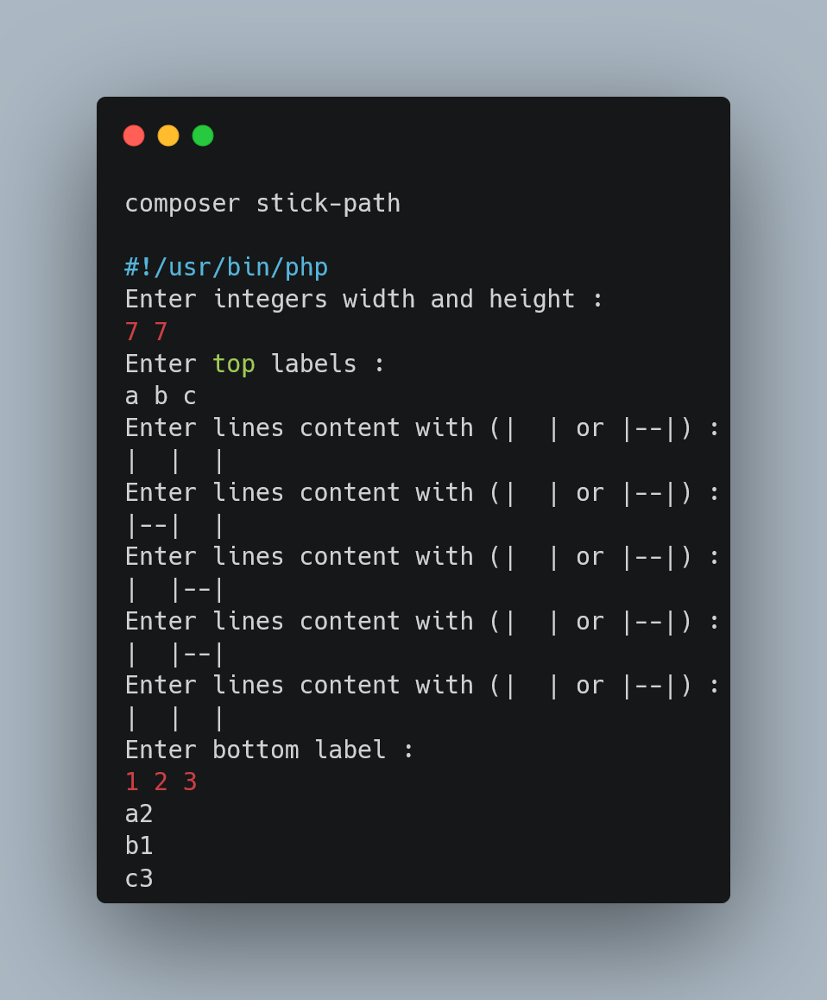

## Description

Implementation of stick path algorithm

## Installation
Require :
- php 8.1
- composer

To install run
`composer install`

## How run

use in terminal `composer stick-path`

## Commands

- `composer tests` to run tests
- `composer analyse` to run quality tools
- `composer stick-path` to run algo

## Todo
- Add more security and control for inputs
- Improve documentation
- Permit to run algo with file data
- Migrate to symfony console componant
- Create Validation class and Stream class
- Add more test (integration)